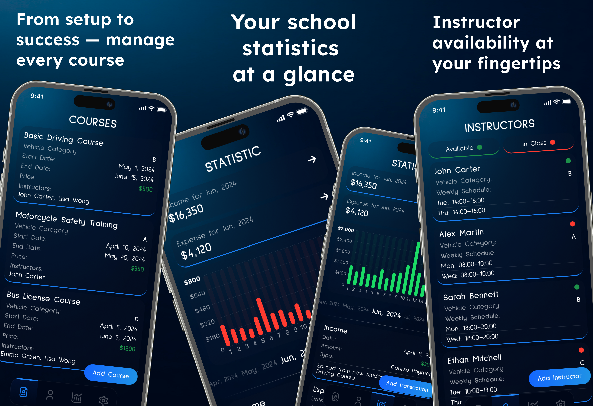
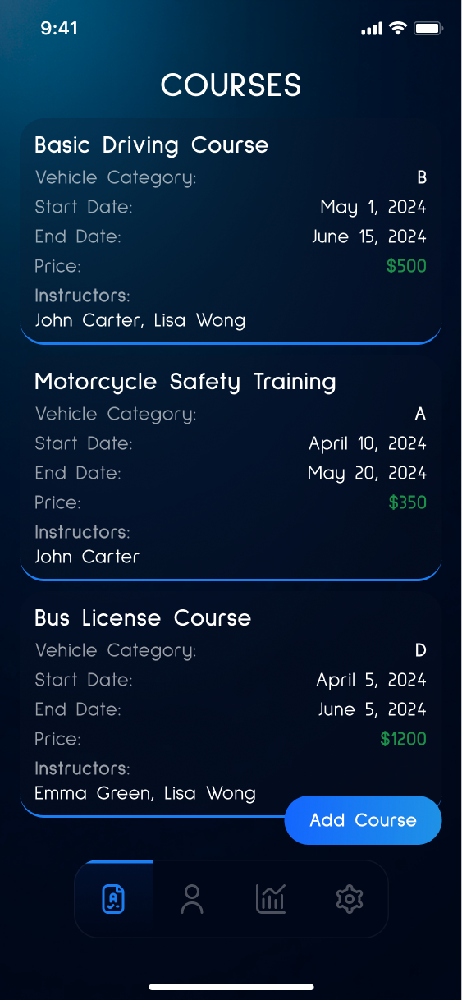
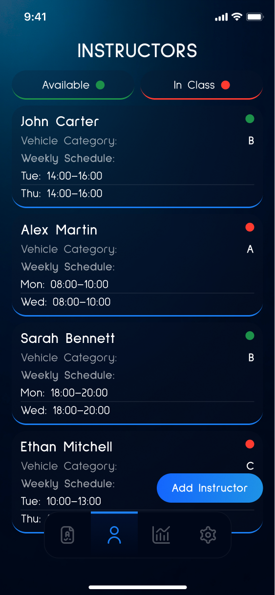
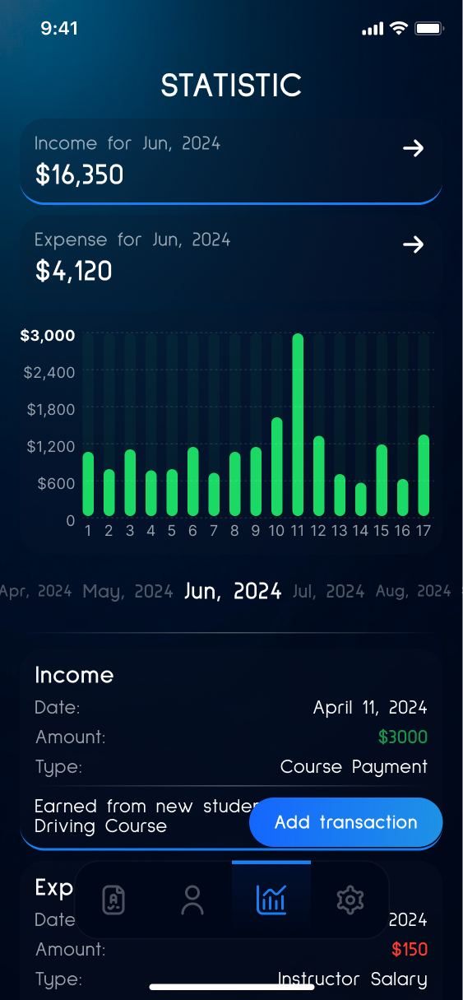

# Pedal Order: Master School

**Pedal Order: Master School** is a complete driving school management app built with Flutter, supporting Android and iOS. It helps to organize courses, instructors, student enrollments, schedules, and financial tracking in one place.



## 🛠️ Technologies

- **Flutter** and **Dart**
- **Provider** — state management
- **Hive** — local storage
- **Flutter ScreenUtil** — responsive layout
- **Custom charts** — for income & expense analytics
- **Local assets** — icons and UI resources

## 📱 Screenshots

| Courses | Instructors | Statistics |
|--------|--------|---------|
|  |  |  |

## 🚀 How to Run

1. Clone the repo
   ```sh
   git clone https://github.com/NMMustafina/pedal_order_master_school.git
   ```
2. Install all the packages by typing the following command
   ```sh
   flutter pub get
   ```
3. Run the App
